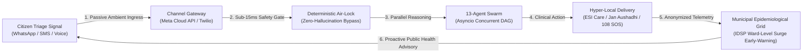
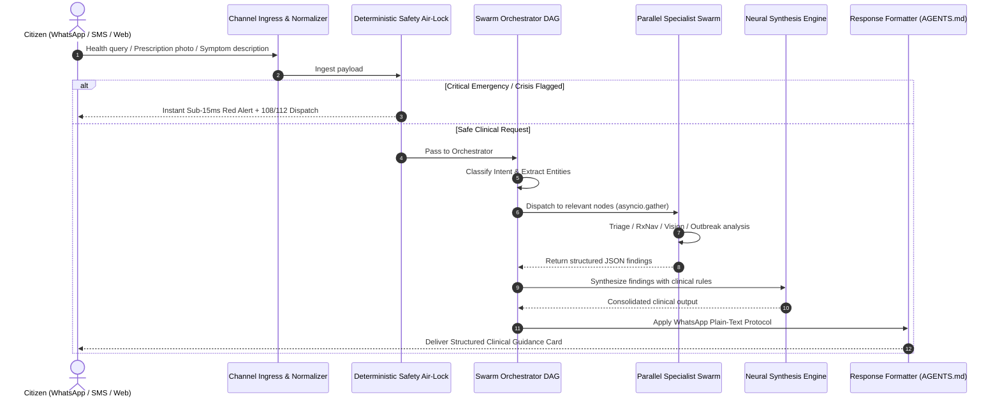
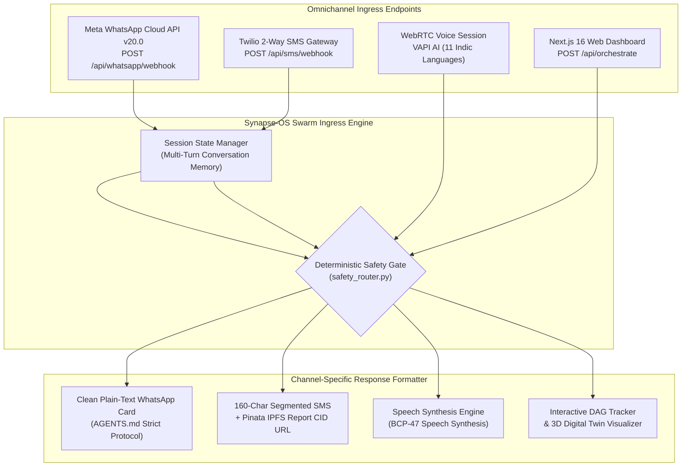
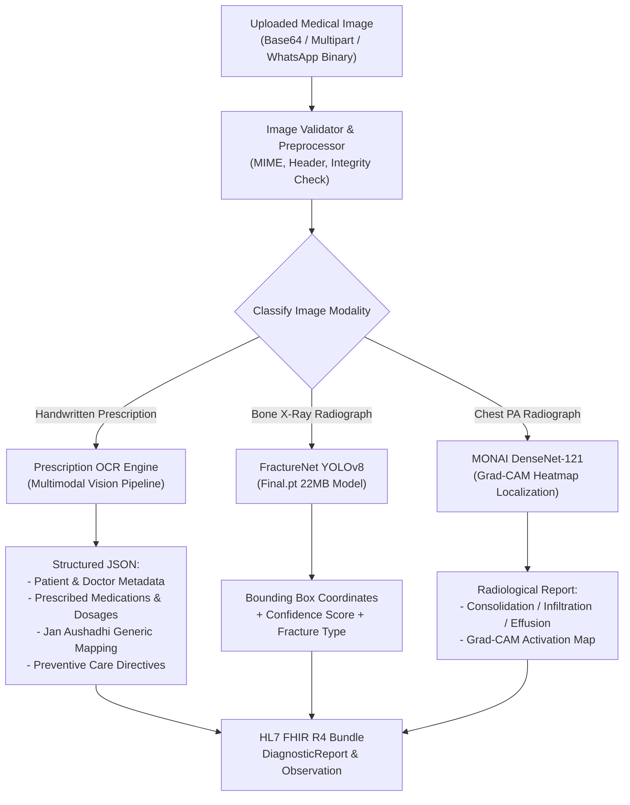
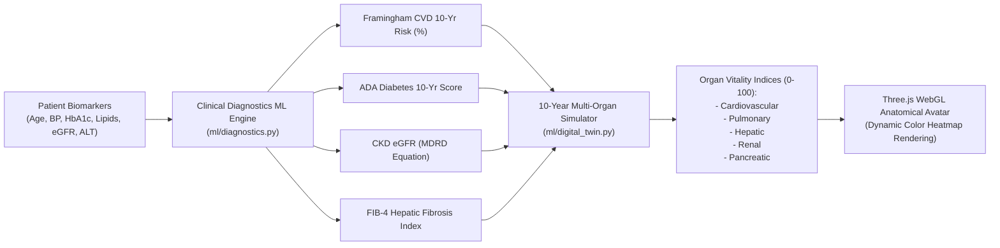
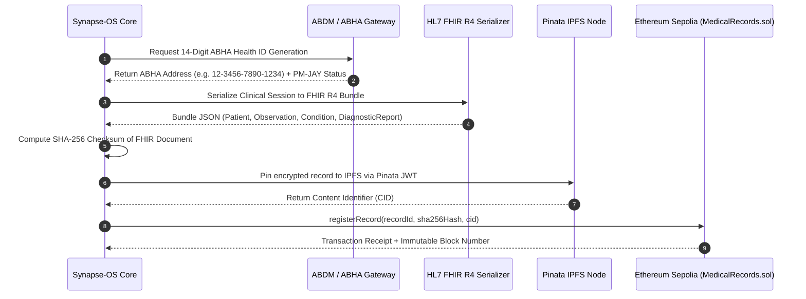
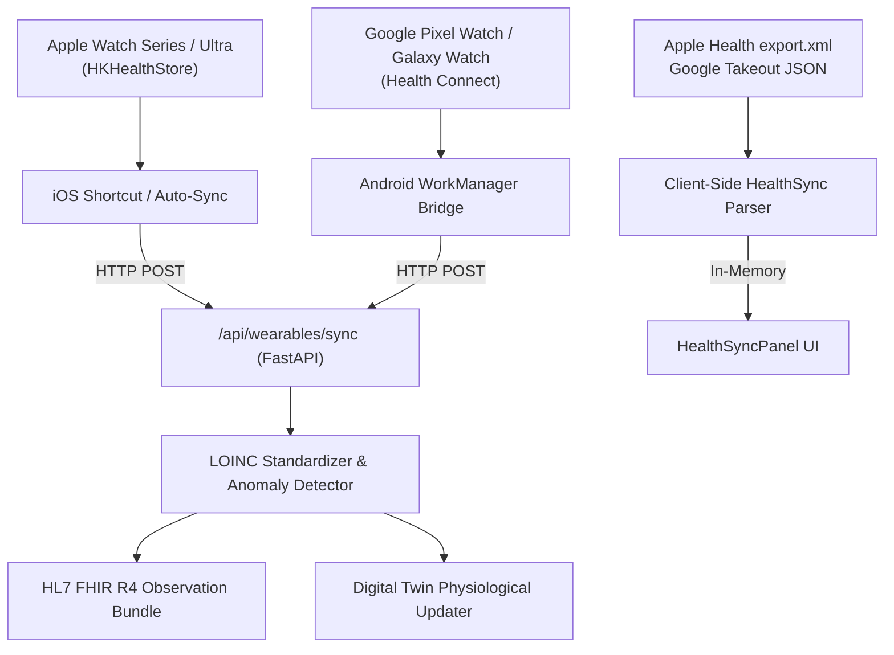
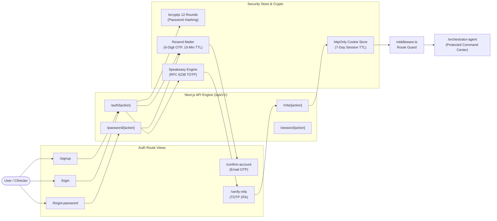
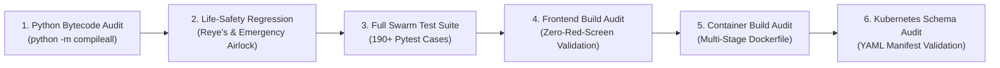

<div align="center">


# Synapse-OS

### Autonomous Urban Health Grid and Multimodal Clinical Intelligence Platform

An open-source, production-grade municipal healthcare operating system engineered to transform urban and rural health delivery. Synapse-OS integrates a multimodal AI clinical swarm, deterministic safety air-locks, 11 Indic regional language engines, and national digital health standards (ABDM, HL7 FHIR R4, and Ethereum Blockchain) accessible to 650+ million citizens over Meta WhatsApp Cloud API and 2G SMS without requiring app installations.

[](https://github.com/Rachit-Tiwari-7/SYNAPSE-OS/actions)
[-success?style=for-the-badge&logo=pytest&logoColor=white)](https://github.com/Rachit-Tiwari-7/SYNAPSE-OS)
[](https://github.com/Rachit-Tiwari-7/SYNAPSE-OS)
[](https://github.com/Rachit-Tiwari-7/SYNAPSE-OS)
[](https://opensource.org/licenses/MIT)

[](https://developers.facebook.com/)
[](https://github.com/Rachit-Tiwari-7/SYNAPSE-OS)
[](https://nextjs.org/)
[](https://react.dev/)
[](https://www.typescriptlang.org/)
[](https://tailwindcss.com/)
[](https://fastapi.tiangolo.com/)
[](https://python.org)
[](https://docker.com)
[](https://kubernetes.io)

<br /><br />


</div>

---

## Table of Contents

- [1. Executive Summary](#1-executive-summary)
- [2. The City as an Immune System Architecture](#2-the-city-as-an-immune-system-architecture)
- [3. Core Engineering Pillars](#3-core-engineering-pillars)
- [4. High-Level System Architecture](#4-high-level-system-architecture)
- [5. Multimodal Clinical AI Swarm (13 Agents)](#5-multimodal-clinical-ai-swarm-13-agents)
- [6. Omnichannel Ingress and Messaging Protocols](#6-omnichannel-ingress-and-messaging-protocols)
- [7. Multilingual Architecture (11 Indic Languages)](#7-multilingual-architecture-11-indic-languages)
- [8. Diagnostic Vision, Radiology and Prescription OCR](#8-diagnostic-vision-radiology-and-prescription-ocr)
- [9. 3D Digital Health Twin and Clinical Diagnostics ML](#9-3d-digital-health-twin-and-clinical-diagnostics-ml)
- [10. National Digital Health Integrations (ABDM, FHIR R4, Blockchain)](#10-national-digital-health-integrations-abdm-fhir-r4-blockchain)
- [11. Wearable Telemetry Ingestion Pipeline](#11-wearable-telemetry-ingestion-pipeline)
- [12. Enterprise Authentication and Security (2FA / MFA)](#12-enterprise-authentication-and-security-2fa--mfa)
- [13. Complete Technology Stack](#13-complete-technology-stack)
- [14. Project Directory Structure](#14-project-directory-structure)
- [15. REST API Reference](#15-rest-api-reference)
- [16. Environment Configuration](#16-environment-configuration)
- [17. Installation, Local Setup and Startup Guide](#17-installation-local-setup-and-startup-guide)
- [18. Docker and Kubernetes Deployment](#18-docker-and-kubernetes-deployment)
- [19. Automated Testing and CI/CD Verification](#19-automated-testing-and-cicd-verification)
- [20. Security Hardening and Responsible Disclosure](#20-security-hardening-and-responsible-disclosure)
- [21. Strategic Roadmap](#21-strategic-roadmap)
- [22. Contributing and License](#22-contributing-and-license)

---

## 1. Executive Summary

Synapse-OS is a production-grade **Autonomous Urban Healthcare Operating Grid**. It transitions municipal healthcare from an overburdened, reactive hospital paradigm into an ambient, decentralized municipal immune system. By operating over standard messaging rails (Meta WhatsApp Cloud API v20.0 and 2G SMS), Synapse-OS eliminates technological friction for citizens while providing municipal health authorities with real-time epidemiological telemetry.

### The Three Critical Challenges in Indian Urban Healthcare

1. **The Prescription and Comprehension Barrier**: Over 70% of outpatients cannot decipher handwritten prescriptions or identify lower-cost generic alternatives. Synapse-OS integrates a **Multimodal Prescription Vision Engine** that transcribes complex medical handwriting, extracts structured dosage schedules, and cross-references the **PM-JAY Pradhan Mantri Bhartiya Janaushadhi Pariyojana (PMBJP)** database to reduce out-of-pocket medication expenses by up to 85%.
2. **Hospital Outpatient Triage Saturation**: Tertiary municipal hospital OPDs in Tier-1, Tier-2, and Tier-3 cities are severely backlogged with non-urgent cases, delaying care for acute emergencies. Synapse-OS implements an autonomous **Emergency Severity Index (ESI Levels 1-5) Triage Pipeline** coupled with a sub-15ms deterministic safety air-lock that intercepts life-threatening events and activates immediate 108/112 ambulance protocols with zero LLM hallucination risk.
3. **Epidemiological Surveillance Latency**: Conventional public health tracking registers outbreaks only after hospital admissions spike. Synapse-OS aggregates anonymized community triage telemetry through an **Integrated Disease Surveillance Programme (IDSP) Engine**, calculating real-time effective reproduction numbers ($R_t$) to alert municipal health commissioners 48 hours prior to ward-level hospital surges.

---

## 2. The City as an Immune System Architecture

Synapse-OS reframes the metropolis into an adaptive biological organism where citizens, community health workers (ASHA/ANM), primary health centres (PHCs), and municipal commissioners form an interconnected public health feedback loop.



### Biological Analogue Matrix

| Biological Analogue | Municipal Immune Function | Synapse-OS Technical Implementation |
| :--- | :--- | :--- |
| **Dendritic Receptors** | Peripheral Signal Capture | Omnichannel WhatsApp v20.0 and 2G GSM SMS ingress active across 650M+ citizen devices with zero app installations. |
| **Reflex Arc** | Immediate Nociceptive Bypass | Node 0 Deterministic Safety Router (`safety_router.py`) executing under 15ms to intercept cardiac arrest, stroke, trauma, and pediatric contraindications. |
| **T-Cell / B-Cell Swarm** | Adaptive Diagnostic Evaluation | 13-agent asynchronous reasoning swarm executing ESI triage, NIH RxNav pharmacology checks, nutrition planning, and multi-agent clinical consensus. |
| **Targeted Antibodies** | Economic and Clinical Relief | Automated Jan Aushadhi generic substitution, 11-language clinical cards, and direct emergency dispatch. |
| **Lymph Node Memory** | Herd Surveillance and Memory | Geospatial IDSP disease surveillance modeling transmission velocity ($R_t$) across municipal wards to detect dengue, malaria, and viral surges. |

---

## 3. Core Engineering Pillars

| # | Engineering Pillar | Architecture and Implementation Details |
| :-: | :--- | :--- |
| **1** | **Deterministic Emergency Air-Lock** | Acute medical emergencies (cardiac arrest, stroke, anaphylaxis, suicide ideation) bypass LLM generation via deterministic regex matching in `safety_router.py` (<15ms latency). Guarantees zero hallucination risk for life-critical conditions. |
| **2** | **Multi-Tier Neural Intelligence Engine** | High-availability clinical design powered by multimodal vision and reasoning models with fallback chains across Groq, Gemini, and deterministic rule engines. |
| **3** | **Handwritten Prescription OCR and Jan Aushadhi Mapping** | Vision models extract handwritten medications, dosages, and frequencies, normalizing them to structured JSON and matching PM-JAY Jan Aushadhi generic equivalents. |
| **4** | **11 Indic Languages on WhatsApp** | Native code-mixed comprehension and generation across English, Hindi, Bengali, Tamil, Telugu, Marathi, Gujarati, Kannada, Malayalam, Punjabi, and Odia. |
| **5** | **Clean Clinical Messaging Protocol** | Enforces plain-text mobile-optimized formatting per `AGENTS.md`: status badges, structured diagnostic impressions, consensus percentages, Indian medication schedules, red flags, and reply shortcuts. |
| **6** | **Interactive 3D Anatomical Digital Twin** | WebGL and Three.js human avatar visualizing organ vitality indices (0-100) and running 10-year longitudinal multi-organ health trajectory simulations (`ml/digital_twin.py`). |
| **7** | **IDSP Outbreak Surveillance and Early Warning** | District-level epidemic tracking (Dengue, Malaria, Nipah, Zika, Cholera) with municipal ward heatmaps, transmission reproduction number ($R_t$) calculation, and automated citizen broadcast alerts. |
| **8** | **UIP and U-WIN Universal Immunization Engine** | Automated milestone calculations based on Ministry of Health and Family Welfare (MoHFW) guidelines from birth to 16 years, generating verifiable U-WIN digital vaccination records. |
| **9** | **2G SMS Gateway and Pinata IPFS Audit Trails** | Low-connectivity rural access via GSM keypad phones (Twilio programmable SMS) paired with tamper-proof health record pinning and CID resolution via Pinata IPFS. |
| **10** | **197 Automated Tests Passing 100% Green** | 190 FastAPI backend integration tests and 7 standalone WhatsApp microservice tests validating pediatric safety (Reye's syndrome prevention), drug interaction matrices, and ABDM/FHIR bundling. |

---

## 4. High-Level System Architecture

Synapse-OS operates as an N-tier microservice and multi-agent system divided into five discrete functional layers:

```mermaid
flowchart TB
    subgraph Layer1["1. Omnichannel Ingress Layer"]
        C1["Meta WhatsApp Cloud API v20.0"]
        C2["Twilio 2-Way SMS Gateway (2G Keypads)"]
        C3["WebRTC Voice AI Orb (VAPI AI)"]
        C4["Next.js 16 Web Command Center"]
    end

    subgraph Layer2["2. Ingress Normalization and Security Layer"]
        G1["FastAPI Channel Adapter"]
        G2{"Node 0: Deterministic Safety Air-Lock\n(<15ms Regex Gate)"}
        G3["i18n Multilingual Translator\n(11 Indic Languages)"]
        G4["MFA / TOTP Route Guard\n(RFC 6238 Speakeasy)"]
    end

    subgraph Layer3["3. Multi-Agent Clinical Swarm (asyncio.gather DAG)"]
        A1["Triage Agent\n(ESI Levels 1-5)"]
        A2["Pharmacology Agent\n(NIH RxNav + PMBJP)"]
        A3["Prescription OCR Agent\n(Multimodal Vision)"]
        A4["Radiology Agent\n(YOLOv8 + MONAI)"]
        A5["Outbreak Agent\n(IDSP / WHO Rt)"]
        A6["Vaccination Agent\n(UIP / U-WIN)"]
        A7["Nutrition Agent\n(ICMR-NIN Rules)"]
        A8["Preventive Health Agent\n(ASHA Protocols)"]
        A9["Mental Health Agent\n(Tele-MANAS 14416)"]
        A10["Council Verifier\n(Consensus Node)"]
        A11["Retrieval Agent\n(Wikipedia + Guidelines)"]
        A12["Appointment Agent\n(PHC / Doctor Slots)"]
    end

    subgraph Layer4["4. Reasoning, Diagnostics and ML Layer"]
        M1["Multimodal LLM Reasoning Engine\n(Groq Qwen 27B / Gemini Pro)"]
        M2["3D Digital Health Twin Engine\n(10-Year Multi-Organ Simulation)"]
        M3["Clinical Risk Calculators\n(Framingham, ADA, CKD MDRD, FIB-4)"]
    end

    subgraph Layer5["5. Persistence, Interoperability and Blockchain Layer"]
        D1[("Redis 7 In-Memory Cache\n& FSM Session Store")]
        D2["HL7 FHIR R4 Serializer\n(LOINC & NDHM Codes)"]
        D3["ABDM ABHA Gateway\n(14-Digit Health ID)"]
        D4[("Pinata IPFS Node\n(Decentralized CIDs)")]
        D5["Ethereum Sepolia Smart Contract\n(MedicalRecords.sol)"]
    end

    Layer1 --> G1
    G1 --> G4 --> G2
    G2 -->|Emergency Intercept| Layer1
    G2 -->|Clinical Query| G3 --> Layer3
    Layer3 <--> Layer4
    Layer3 --> Layer5
    Layer5 --> Layer1
```



---

## 5. Multimodal Clinical AI Swarm (13 Agents)

Synapse-OS executes a synchronized state graph pipeline defined in `backend/app/agents/orchestrator.py`. Every incoming request is classified into an execution intent and processed concurrently using Python `asyncio.gather`, maintaining a unified `SynapseOSState` context.



### Specialist Agent Matrix

| Agent Name | Source File | Core Responsibility | External Services and Standards |
| :--- | :--- | :--- | :--- |
| **Deterministic Safety Gate** | `core/safety_router.py` | Sub-15ms pre-pipeline intercept for acute emergencies, suicide crisis, and pediatric contraindications. Bypasses all LLMs. | Internal Regex Database, Emergency Dispatch Protocols (108, 112, 14416) |
| **Swarm Orchestrator** | `agents/orchestrator.py` | Dynamic intent classification, DAG execution routing, multi-agent dispatch, and unified clinical synthesis. | Pydantic `SynapseOSState`, asyncio concurrency engine |
| **Clinical Symptom Triage** | `agents/triage_agent.py` | ESI Level 1-5 urgency classification. Categorizes cases into Emergency, Doctor Consult (24-48h), or Home Care. | Emergency Severity Index (ESI), WHO Triage Protocols |
| **Drug Safety and Pharmacology** | `agents/drug_agent.py` | NIH RxNorm drug normalization, CYP3A4 interaction logic, and contraindication screening across high-risk pairs. | NIH RxNav REST API, PM-JAY Jan Aushadhi Database |
| **Prescription Vision OCR** | `services/prescription_ocr_service.py` | Multimodal transcription of blurry handwritten doctor prescriptions, dosage extraction, and Jan Aushadhi generic matching. | Multimodal Vision API, PIL Image Engine |
| **Medical Scan AI** | `agents/scan_agent.py` | Automated bone fracture detection using FractureNet YOLOv8 and chest PA radiograph analysis via MONAI DenseNet-121. | Ultralytics YOLOv8 (`Final.pt`), MONAI, PyTorch |
| **Outbreak Surveillance** | `agents/outbreak_agent.py` | District-level epidemic tracking (Dengue, Malaria, Nipah, Zika), $R_t$ surge calculations, and broadcast advisories. | IDSP Database, WHO Global Health Observatory |
| **Universal Immunization** | `agents/vaccination_agent.py` | Indian UIP milestone computation from birth to 16 years (BCG, OPV, Pentavalent, MR) and U-WIN digital certificate creation. | MoHFW UIP Guidelines, U-WIN System Schema |
| **Clinical Nutrition and Diet** | `agents/nutrition_agent.py` | Condition-specific dietary guidance for Diabetes, Hypertension, Anemia, Diarrhea, and Fever across 40+ Indian staples. | ICMR-NIN Dietary Guidelines, Indian Food Composition Tables (IFCT) |
| **Rural Preventive Health** | `agents/preventive_health_agent.py` | ASHA worker field guidance, ORS preparation directives, POSHAN nutrition education, and interactive health quizzes. | National Health Mission (NHM) Protocols, POSHAN Abhiyaan |
| **Mental Health Support** | `agents/mental_health_agent.py` | Crisis intervention, depression screening, and direct routing to India's 24x7 Tele-MANAS toll-free line. | Tele-MANAS (14416), WHO mhGAP Intervention Guide |
| **Council Verifier** | `agents/verification_agent.py` | Cross-validates generated recommendations against verified medical databases to score clinical consensus. | Medical Reference Grounding Engine |
| **Hybrid Knowledge Retrieval** | `agents/retrieval_agent.py` | Parallel lookup across Wikipedia Medical REST and 23 curated WHO, ICMR, and MoHFW clinical guidelines. | Wikimedia REST API, Curated Guideline Index |
| **Teleconsult Appointment** | `agents/appointment_agent.py` | Empanelled doctor discovery by specialty, Primary Health Centre (PHC) routing, and consultation scheduling. | National Health Scheme Registry, Calendar Engine |

---

## 6. Omnichannel Ingress and Messaging Protocols

Synapse-OS natively serves users across four distinct communication channels:



### Meta WhatsApp Cloud API v20.0 Implementation

The WhatsApp integration (`backend/app/services/meta_whatsapp_service.py` and `meta_whatsapp_client.py`) connects directly to Meta's Graph API:

1. **Webhook Verification Handshake**: Handles `GET /api/whatsapp/webhook` with `hub.mode`, `hub.verify_token`, and `hub.challenge`.
2. **Inbound Message Parsing**: Ingests incoming text, quick-reply button clicks, list selections, and media (images of prescriptions and X-rays).
3. **Session FSM Engine**: In-memory multi-turn state tracking managing language preferences, triage history, and pending questionnaire responses.
4. **Media Pipeline**: Automatically fetches media URLs from Meta's infrastructure, downloads binary streams via Bearer token auth, and routes images to `prescription_ocr_service.py` or `scan_agent.py`.

### Strict WhatsApp Plain-Text Protocol

In adherence to the formatting rules defined in `AGENTS.md`, all WhatsApp clinical cards are generated in clean plain text without Markdown syntax (`*`, `**`, `_`, `#`, `---`, or backticks) that can distort message readability on low-cost mobile displays:

```text
SYNAPSE EMERGENCY TRIAGE - CRITICAL
====================================
Suspected Diagnosis: Acute Hypertensive Crisis with Angina Symptoms
Council Consensus: 95% Clinical Agreement
Immediate Actions:
1. Rest in a seated position immediately. Do not exert yourself.
2. Call 108 or 112 immediately for emergency medical transport.
Medications and Relief (India):
- Withhold self-medication until emergency medical examination.
Seek Emergency Care / Call 108 If:
- Chest pain radiates to left arm or jaw, severe shortness of breath, SpO2 below 92%.
Quick Shortcuts:
- Reply 'sos' for instant location dispatch
- Reply 'menu' for main directory
- Reply 'lang' to change language
Powered by Synapse-OS Multi-Agent Swarm
```

### 2G SMS Gateway and Pinata IPFS Architecture

For rural areas with basic 2G feature phones:
1. Patients send natural language SMS messages (e.g., `fever and cough for 3 days`) or interactive codes (`1` to `9`) to the Twilio gateway number.
2. `backend/app/services/sms_service.py` processes the payload and invokes the multi-agent swarm.
3. Because SMS cannot deliver rich imagery or multi-page documents, the triage summary and HL7 FHIR record are pinned to **Pinata IPFS**.
4. The patient receives an immediate plain-text SMS containing concise clinical instructions and a lightweight IPFS decentralized record URL (`https://gateway.pinata.cloud/ipfs/Qm...`).

---

## 7. Multilingual Architecture (11 Indic Languages)

Synapse-OS provides complete native localization across 11 major Indian languages and English across both web and messaging interfaces:

| Language Code | Language Name | Native Script Name | BCP-47 Speech Code | Translation Coverage |
| :--- | :--- | :--- | :--- | :--- |
| `en` | English | English | `en-US` | Full UI, Triage, Clinical Swarm, API |
| `hi` | Hindi | हिन्दी | `hi-IN` | Full UI, Triage, WhatsApp FSM, Audio |
| `bn` | Bengali | বাংলা | `bn-IN` | Full UI, Triage, WhatsApp FSM, Audio |
| `ta` | Tamil | தமிழ் | `ta-IN` | Full UI, Triage, WhatsApp FSM, Audio |
| `te` | Telugu | తెలుగు | `te-IN` | Full UI, Triage, WhatsApp FSM, Audio |
| `mr` | Marathi | मराठी | `mr-IN` | Full UI, Triage, WhatsApp FSM, Audio |
| `gu` | Gujarati | ગુજરાતી | `gu-IN` | Full UI, Triage, WhatsApp FSM, Audio |
| `kn` | Kannada | ಕನ್ನಡ | `kn-IN` | Full UI, Triage, WhatsApp FSM, Audio |
| `ml` | Malayalam | മലയാളം | `ml-IN` | Full UI, Triage, WhatsApp FSM, Audio |
| `pa` | Punjabi | ਪੰਜਾਬੀ | `pa-IN` | Full UI, Triage, WhatsApp FSM, Audio |
| `or` | Odia | ଓଡ଼ିଆ | `or-IN` | Full UI, Triage, WhatsApp FSM, Audio |

### Localization Implementation

- **Frontend**: Managed via `frontend/src/context/LanguageContext.tsx`, loading 11 modular locale dictionaries and a 236 KB dynamic clinical dictionary (`dynamicMedical.ts`).
- **Backend**: Managed via `backend/app/services/i18n_service.py`, providing automatic script detection, pre-translated emergency safety templates, and localized clinical responses.
- **WhatsApp FSM**: Users can text `lang`, `bhasha`, or `भाषा` at any time to trigger the interactive 11-language selection menu.

---

## 8. Diagnostic Vision, Radiology and Prescription OCR

Synapse-OS integrates specialized computer vision models and multimodal vision pipelines to process diverse medical imagery:



### 1. Handwritten Prescription OCR Engine

- **Service**: `backend/app/services/prescription_ocr_service.py`
- **Capabilities**: Reads unconstrained cursive handwriting, transcribes raw text verbatim, extracts patient/doctor headers, parses complex dosage schedules (`OD`, `BD`, `TDS`, `1-0-1`), derives probable clinical diagnoses, and suggests PMBJP Jan Aushadhi generic alternatives.
- **Safety**: Rejects blank or unreadable images, sanitizes text against prompt injection, and flags ambiguous handwriting for human clinician review.

### 2. FractureNet YOLOv8 Bone Radiography

- **Model**: Custom-trained Ultralytics YOLOv8 architecture (`backend/Final.pt`, 22 MB).
- **Execution**: `backend/app/agents/scan_agent.py` runs inference on uploaded musculoskeletal X-rays with a confidence threshold of `conf=0.15`, returning localized bounding boxes, fracture classifications, and anatomical site identification.

### 3. MONAI DenseNet-121 Chest PA Interpretation

- **Framework**: Medical Open Network for AI (MONAI) with PyTorch DenseNet-121 backbone.
- **Execution**: Evaluates chest radiographs for pulmonary consolidation, pleural effusion, cardiomegaly, and pneumothorax, generating Grad-CAM visual activation heatmaps to highlight pathology locations for clinicians.

---

## 9. 3D Digital Health Twin and Clinical Diagnostics ML

Synapse-OS features an interactive **3D Anatomical Digital Twin** paired with predictive mathematical physiology engines:



### Validated Clinical Risk Engines

1. **Framingham Cardiovascular Risk Score**: Evaluates 10-year risk of coronary heart disease based on age, systolic BP, total cholesterol, HDL, and smoking status.
2. **ADA Diabetes Risk Predictor**: Calculates 10-year type-2 diabetes probability using BMI, fasting plasma glucose, family history, and physical activity.
3. **CKD-EPI / MDRD Renal Function Calculation**: Evaluates estimated Glomerular Filtration Rate (eGFR) in $\text{mL/min/1.73m}^2$ from serum creatinine, age, and sex.
4. **FIB-4 Liver Fibrosis Score**: Combines platelet count, ALT, AST, and age to classify non-alcoholic fatty liver disease (NAFLD) fibrosis stages.
5. **10-Year Multi-Organ Longitudinal Projection**: Simulates organ decay trajectories under current lifestyle versus targeted medical interventions over a decade.

---

## 10. National Digital Health Integrations (ABDM, FHIR R4, Blockchain)

Synapse-OS is engineered for complete compliance with India's Ayushman Bharat Digital Mission (ABDM) and international health informatics standards:



### 1. ABDM ABHA Gateway (`services/abdm_service.py`)
- Generates 14-digit Ayushman Bharat Health Account (ABHA) IDs formatted as `XX-XXXX-XXXX-XXXX`.
- Validates eligibility for the **Pradhan Mantri Jan Arogya Yojana (PM-JAY)** ₹5 Lakh cashless health cover.
- Maps empanelled public health schemes including Ni-kshay (Tuberculosis), Tele-MANAS (Mental Health), and Jan Aushadhi (Affordable Medicines).

### 2. HL7 FHIR R4 Serialization (`services/fhir_service.py`)
- Emits fully validated **HL7 FHIR Release 4 JSON Bundles** representing clinical encounters.
- Encodes observations using standard **Logical Observation Identifiers Names and Codes (LOINC)** and **Systematized Nomenclature of Medicine (SNOMED CT)** standards.
- Embeds official **National Digital Health Mission (NDHM)** identifier systems.

### 3. Blockchain Medical Records (`MedicalRecords.sol`)
- Smart contract written in **Solidity 0.8.20** and deployed on Ethereum Sepolia and local Hardhat environments.
- Implements owner-controlled access management (`grantAccess`, `revokeAccess`, `hasAccess`).
- Stores immutable SHA-256 document checksums and IPFS CIDs to guarantee tamper-proof auditability for medical records and prescriptions.

---

## 11. Wearable Telemetry Ingestion Pipeline

Synapse-OS provides four pathways for synchronizing consumer wearable data with clinical records:



### Supported LOINC Biomarker Specifications

| Telemetry Signal | LOINC Code | Measurement Unit | Clinical Monitoring Objective |
| :--- | :--- | :--- | :--- |
| **Heart Rate** | `8867-4` | Beats per Minute (BPM) | Resting tachycardia, bradycardia, arrhythmia screening |
| **Oxygen Saturation (SpO2)** | `59408-5` | Percentage (%) | Hypoxia and respiratory distress detection |
| **Heart Rate Variability (HRV)** | `80404-7` | Milliseconds (ms) | Autonomic nervous system recovery and stress index |
| **Single-Lead ECG** | `131344-0` | Microvolts / Waveform | Atrial fibrillation (AFib) screening |
| **Daily Step Count** | `41950-7` | Steps / Day | Physical activity and rehabilitation compliance |
| **Sleep Duration** | `93832-4` | Hours (h) | Sleep architecture and circadian rhythm analysis |
| **Blood Glucose** | `2339-0` | mg/dL | Glycemic variability and diabetes management |
| **Blood Pressure** | `55284-4` | mmHg (Systolic / Diastolic) | Hypertension classification and vascular load |

---

## 12. Enterprise Authentication and Security (2FA / MFA)

Synapse-OS implements a complete, self-contained multi-factor authentication architecture built directly into the Next.js App Router:



### Security Capabilities

- **RFC 6238 Time-Based One-Time Password (TOTP)**: Compatible with Google Authenticator, Authy, and 1Password with QR code setup and manual secret keys.
- **Transactional Email Verification**: 6-digit verification codes powered by Resend with 10-minute expiration windows.
- **Session Management**: Secure, `httpOnly` cookie-backed sessions with multi-device session listing and individual session revocation.
- **Route Guard Middleware**: `frontend/src/middleware.ts` enforces authentication checks across all clinical dashboard routes.

---

## 13. Complete Technology Stack

### Frontend Architecture
- **Framework**: Next.js 16.3.1 (React 19.2.8, App Router, Standalone Output)
- **Language**: TypeScript 5.x (Strict Type Checking)
- **Styling**: Tailwind CSS 4.x, Lucide React Icons
- **3D Visualization**: Three.js, React Three Fiber, WebGL Shader Engine
- **Geospatial Mapping**: D3-Geo, D3-Scale, React-Simple-Maps, TopoJSON Client
- **Voice AI Interface**: VAPI AI Web SDK (WebRTC Audio Stream)
- **Smooth Interaction**: Lenis 1.3.26 Smooth Scroll Engine

### Backend and Multi-Agent Core
- **Framework**: FastAPI 0.110+ (ASGI High-Concurrency Runtime)
- **Server**: Uvicorn with Multi-Worker Process Model
- **Language**: Python 3.11
- **Validation**: Pydantic v2 (Strict Schema Enforcement)
- **HTTP Client**: HTTPX (Asynchronous Connection Pooling)
- **Document Generation**: ReportLab 4.1+ (Clinical PDF Reports), Python-QRCode

### Machine Learning and Diagnostic Vision
- **Handwriting OCR**: Multimodal Vision LLM Pipeline (`prescription_ocr_service.py`)
- **Musculoskeletal Detection**: Ultralytics YOLOv8 Architecture (`backend/Final.pt`, 22 MB)
- **Pulmonary Radiography**: MONAI DenseNet-121 with Grad-CAM Activation Mapping
- **Digital Twin**: Custom Mathematical Multi-Organ Degradation Simulation (`ml/digital_twin.py`)
- **Clinical Biomarkers**: Framingham CVD, ADA Diabetes, CKD MDRD, FIB-4 Index Calculations

### Blockchain and Web3 Records
- **Smart Contracts**: Solidity 0.8.20 (`MedicalRecords.sol`)
- **EVM Networks**: Ethereum Sepolia Testnet, Hardhat Local Node
- **Contract Client**: Ethers.js v6.17.0
- **Decentralized Storage**: Pinata Cloud IPFS Gateway, Kubo IPFS Node

### DevOps and Infrastructure
- **Containerization**: Docker Multi-Stage Builds, Docker Compose v3.8
- **Orchestration**: Kubernetes Manifests (Deployments, Services, Ingress, HPA)
- **Caching and Events**: Redis 7 Alpine
- **Ingress Tunnels**: Cloudflare Tunnel (`cloudflared`), Ngrok Static Domain
- **CI/CD Automation**: GitHub Actions, CodeQL SAST Scanning, Pytest Matrix

---

## 14. Project Directory Structure

```text
SYNAPSE-NEURAL/
├── .github/
│   └── workflows/
│       ├── cd.yml                      # Automated multi-platform container delivery
│       ├── ci.yml                      # 190+ test CI suite, linting, build checks
│       └── security-scan.yml           # CodeQL SAST and dependency audits
├── architecture-docs/                  # High-resolution architectural diagrams
│   ├── Architecture Diagram Dark.png
│   ├── Architecture Diagram Light.png
│   ├── Flowchart dark.png
│   └── sanjeevni_executive_presentation.pdf
├── backend/
│   ├── app/
│   │   ├── agents/                     # 13 Multi-agent swarm modules
│   │   │   ├── appointment_agent.py    # Doctor scheduling & PHC routing
│   │   │   ├── drug_agent.py           # NIH RxNav drug interactions & PMBJP
│   │   │   ├── mental_health_agent.py  # Tele-MANAS (14416) & WHO mhGAP
│   │   │   ├── nutrition_agent.py      # ICMR-NIN & IFCT dietary rules engine
│   │   │   ├── orchestrator.py         # Swarm DAG orchestrator & intent router
│   │   │   ├── outbreak_agent.py       # IDSP district outbreak surveillance
│   │   │   ├── preventive_health_agent.py # ASHA tools, ORS, POSHAN education
│   │   │   ├── retrieval_agent.py      # Hybrid guideline & Wikipedia retrieval
│   │   │   ├── scan_agent.py           # YOLOv8 & MONAI imaging agents
│   │   │   ├── triage_agent.py         # ESI Level 1-5 symptom triage
│   │   │   ├── vaccination_agent.py    # UIP / U-WIN immunization scheduler
│   │   │   └── verification_agent.py   # AI Council consensus verification
│   │   ├── api/
│   │   │   └── endpoints.py            # 30+ production REST API endpoints
│   │   ├── core/
│   │   │   ├── config.py               # Pydantic environment configuration
│   │   │   ├── safety_router.py        # Sub-15ms deterministic safety air-lock
│   │   │   ├── session_manager.py      # WhatsApp multi-turn conversation FSM
│   │   │   └── state.py                # SynapseOSState shared schema
│   │   ├── ml/
│   │   │   ├── diagnostics.py          # Framingham, ADA, CKD, FIB-4 calculators
│   │   │   └── digital_twin.py         # 10-year multi-organ trajectory simulator
│   │   ├── services/
│   │   │   ├── abdm_service.py         # 14-digit ABHA ID generator & PM-JAY
│   │   │   ├── fhir_service.py         # HL7 FHIR R4 JSON bundle builder
│   │   │   ├── i18n_service.py         # 11-language Indic clinical translation
│   │   │   ├── llm_service.py          # Multi-tier LLM reasoning engine
│   │   │   ├── meta_whatsapp_client.py # Meta WhatsApp Graph API client
│   │   │   ├── meta_whatsapp_service.py # Webhook parser & interactive FSM
│   │   │   ├── pdf_service.py          # ReportLab clinical PDF generator
│   │   │   ├── pinata_service.py       # Decentralized IPFS pinning service
│   │   │   ├── prescription_ocr_service.py # Multimodal prescription OCR
│   │   │   ├── sms_service.py          # Twilio 2-way SMS gateway handler
│   │   │   └── whatsapp_service.py     # Unified WhatsApp export interface
│   │   └── main.py                     # FastAPI application entrypoint
│   ├── tests/                          # 14 comprehensive test modules (190+ tests)
│   ├── Dockerfile                      # Python 3.11 slim production container
│   ├── Final.pt                        # FractureNet YOLOv8 custom weights (22 MB)
│   └── requirements.txt                # Python backend dependencies
├── blockchain/
│   └── contracts/
│       ├── contracts/
│       │   └── MedicalRecords.sol      # Solidity 0.8.20 health record registry
│       ├── scripts/                    # Deployment scripts for Sepolia & Localhost
│       └── hardhat.config.js           # Hardhat EVM network configuration
├── docs/                               # Deep-dive technical specifications
│   ├── 2FA.md                          # Multi-factor authentication design
│   ├── AI-Health-Platform-MultiAgent-Plan.md
│   ├── DOCKER_K8S_INFRASTRUCTURE.md    # Cluster deployment documentation
│   ├── GUIDE.md                        # Developer onboarding guide
│   ├── TESTING_AND_CICD.md             # Verification test suite documentation
│   ├── WEARABLE_BRIDGE_SPEC.md         # LOINC telemetry mapping specification
│   ├── agent_explanation.md            # Comprehensive agent behavior breakdowns
│   └── backend_working_apis.md         # Verified endpoint documentation
├── frontend/
│   ├── public/                         # Static assets and icons
│   ├── src/
│   │   ├── app/                        # Next.js 16 App Router pages
│   │   │   ├── confirm-account/        # Email OTP confirmation page
│   │   │   ├── forgot-password/        # Password reset initiation page
│   │   │   ├── login/                  # User login page
│   │   │   ├── orchestrator-agent/     # Full Orchestrator Command Center
│   │   │   ├── reset-password/         # Tokenized password reset page
│   │   │   ├── signup/                 # User registration page
│   │   │   ├── verify-mfa/             # TOTP 2FA verification challenge
│   │   │   ├── layout.tsx              # Root application layout
│   │   │   └── page.tsx                # Public landing page
│   │   ├── components/
│   │   │   ├── assistant/              # Floating AI Copilot & Voice Orb
│   │   │   ├── home/                   # Landing page presentation sections
│   │   │   ├── orchestrator/           # 11 Command center dashboard panels
│   │   │   │   ├── ActionHubExportModal.tsx
│   │   │   │   ├── AiHealthChatPanel/
│   │   │   │   ├── BlockchainRecordsPanel/
│   │   │   │   ├── ClinicalConditionsPanel/
│   │   │   │   ├── InteractiveBodyTwin/
│   │   │   │   ├── NutritionPanel.tsx
│   │   │   │   ├── PatientVitalsPanel/
│   │   │   │   ├── RuralHealthPanel/
│   │   │   │   ├── SecuritySessionsPanel.tsx
│   │   │   │   ├── SwarmIntelligencePanel/
│   │   │   │   └── WhatsAppChatbotPanel/
│   │   │   └── ui/                     # Shared UI components
│   │   ├── context/
│   │   │   ├── AuthContext.tsx         # Authentication and session state
│   │   │   ├── LanguageContext.tsx     # 11-Language localization state
│   │   │   └── translations/           # Locale dictionaries and dynamic medical text
│   │   └── lib/blockchain/             # Ethers.js client contract & IPFS helpers
│   ├── Dockerfile                      # Multi-stage Node 20 Alpine container
│   ├── package.json                    # Frontend dependencies and scripts
│   └── tsconfig.json                   # TypeScript configuration
├── k8s/                                # 8 Production Kubernetes manifests
│   ├── backend-deployment.yaml
│   ├── configmap.yaml
│   ├── frontend-deployment.yaml
│   ├── hpa.yaml
│   ├── ingress.yaml
│   ├── namespace.yaml
│   ├── openwa-deployment.yaml
│   └── secrets.yaml
├── Preview Images/                     # 12 Numbered UI demonstration screenshots
├── scripts/                            # Operational runner scripts
│   ├── run-tests.ps1                   # Windows test runner
│   └── run-tests.sh                    # Linux / macOS test runner
├── AGENTS.md                           # Strict multi-agent messaging protocols
├── CLAUDE.md                           # Repository coding & surgical modification rules
├── docker-compose.yml                  # Full-stack local multi-container development
├── docker-compose.prod.yml             # Hardened production container stack
├── startup.md                          # Master configuration & live WhatsApp startup guide
└── README.md                           # Master system documentation
```

---

## 15. REST API Reference

The FastAPI backend exposes 30+ REST endpoints. When running locally, interactive Swagger UI documentation is available at `http://127.0.0.1:8000/docs`.

### 1. Clinical Swarm and Orchestration

| Method | Endpoint | Description | Key Payload Parameters |
| :--- | :--- | :--- | :--- |
| `POST` | `/api/orchestrate` | Executes the complete multi-agent DAG pipeline (safety gate, intent routing, agent swarm, synthesis). | `{"message": str, "channel": "web", "session_id": str, "language": "hi"}` |
| `POST` | `/api/triage` | Performs standalone ESI Level 1-5 triage analysis. | `{"symptoms": str, "age": int, "vitals": dict}` |
| `POST` | `/api/drugs/check` | Checks drug-drug interactions via NIH RxNav. | `{"drugs": ["Aspirin", "Ibuprofen"]}` |
| `POST` | `/api/scans/analyze` | Evaluates bone X-rays (YOLOv8) or chest radiographs (MONAI). | `{"image_base64": str, "scan_type": "xray"}` |
| `POST` | `/api/scans/prescription-ocr` | Transcribes handwritten prescriptions into structured FHIR JSON. | `{"image_base64": str}` |
| `POST` | `/api/nutrition/guide` | Generates condition-specific Indian dietary advice. | `{"condition": "diabetes", "diet_type": "veg"}` |
| `POST` | `/api/nutrition/check-food` | Verifies the clinical safety of a specific Indian food item. | `{"food_name": "moong dal", "conditions": ["hypertension"]}` |
| `GET` | `/api/benchmarks/accuracy` | Returns empirical clinical accuracy validation metrics. | None |

### 2. Diagnostics and 3D Digital Health Twin

| Method | Endpoint | Description | Key Payload Parameters |
| :--- | :--- | :--- | :--- |
| `GET` | `/api/digital-twin/baseline` | Computes baseline multi-organ vitality scores (0-100). | None |
| `POST` | `/api/digital-twin/simulate` | Simulates a 10-year longitudinal multi-organ trajectory. | `{"age": 45, "systolic_bp": 135, "hba1c": 6.8, "egfr": 82}` |
| `POST` | `/api/diagnostics/risk-score` | Calculates Framingham, ADA, CKD MDRD, and FIB-4 risk scores. | `{"age": 52, "gender": "male", "cholesterol": 220, "hdl": 38}` |

### 3. National Health Schemes and Records

| Method | Endpoint | Description | Key Payload Parameters |
| :--- | :--- | :--- | :--- |
| `GET` | `/api/abdm/generate-id` | Generates a 14-digit ABHA Health ID and PM-JAY profile. | None |
| `GET` | `/api/abdm/schemes` | Lists active national public health welfare schemes. | None |
| `GET` | `/api/fhir/bundle` | Generates a compliant HL7 FHIR R4 clinical bundle. | `?session_id=str` |
| `POST` | `/api/reports/generate-pdf` | Produces a clinical PDF summary with a verifiable blockchain QR code. | `{"patient_name": str, "triage_summary": dict}` |

### 4. Omnichannel Gateways and Emergency

| Method | Endpoint | Description | Key Payload Parameters |
| :--- | :--- | :--- | :--- |
| `GET` | `/api/whatsapp/webhook` | Meta Webhook verification challenge handshake. | `hub.mode, hub.verify_token, hub.challenge` |
| `POST` | `/api/whatsapp/webhook` | Ingestion endpoint for live Meta WhatsApp Cloud API events. | Official Meta Webhook JSON Payload |
| `POST` | `/api/whatsapp/quick-reply` | Compact mobile card simulation endpoint. | `{"sender_phone": str, "message": str, "compact": true}` |
| `POST` | `/api/whatsapp/simulate` | Simulates incoming WhatsApp messages and media for testing. | `{"sender_phone": str, "message": str}` |
| `GET` | `/api/whatsapp/languages` | Lists all 11 supported Indic regional languages. | None |
| `POST` | `/api/whatsapp/set-language` | Updates the session language preference. | `{"sender_phone": str, "language": "hi"}` |
| `POST` | `/api/sos/dispatch` | Dispatches 1-click Emergency SOS alert. | `{"location": {"lat": float, "lng": float}, "symptoms": str}` |
| `POST` | `/api/sms/webhook` | Twilio 2-way SMS webhook returning TwiML XML. | `application/x-www-form-urlencoded (From, Body)` |
| `POST` | `/api/sms/inbound` | 2G plain-text SMS receiver for basic keypad phones. | `{"from_number": str, "body": str}` |
| `POST` | `/api/ipfs/pin-json` | Pins clinical FHIR records to Pinata IPFS. | `{"record_data": dict}` |

### 5. Public Health, Vaccines and Outbreaks

| Method | Endpoint | Description | Key Payload Parameters |
| :--- | :--- | :--- | :--- |
| `GET` | `/api/vaccination/schedule` | Computes Indian UIP age-milestone vaccine due dates. | `?age_weeks=6` |
| `POST` | `/api/vaccination/uwin` | Creates a digital U-WIN immunization certificate. | `{"beneficiary_name": str, "vaccine_name": "BCG"}` |
| `GET` | `/api/outbreak/district-risk` | Retrieves district-level epidemiological surge risk data. | `?district=Delhi` |
| `POST` | `/api/outbreak/broadcast` | Broadcasts emergency disease advisories to community phones. | `{"district": str, "pathogen": "Dengue", "advisory": str}` |
| `GET` | `/api/preventive/topics` | Returns ASHA community healthcare education guides. | None |
| `POST` | `/api/preventive/quiz` | Generates and grades public health awareness quizzes. | `{"topic": "ORS", "answers": list}` |

---

## 16. Environment Configuration

Create `.env` in the project root by copying `.env.example`. The platform includes offline simulation fallbacks for all external services:

```env
# ============================================================
# Meta Official WhatsApp Cloud API (Graph API) Settings
# ============================================================
WHATSAPP_CLOUD_API_TOKEN="your_meta_temporary_or_permanent_token"
WHATSAPP_PHONE_NUMBER_ID="your_phone_number_id"
WHATSAPP_BUSINESS_ACCOUNT_ID="your_business_account_id"
WHATSAPP_WEBHOOK_VERIFY_TOKEN="synapse_secret_token_123"
WHATSAPP_API_VERSION="v20.0"

# ============================================================
# Multimodal AI Swarm Engine (Groq / Gemini / OpenRouter)
# ============================================================
GROQ_API_KEY="your_groq_api_key"
GROQ_MODEL="qwen/qwen3.8-27b"
GEMINI_API_KEY="your_gemini_api_key"
GEMINI_MODEL="gemini-1.5-flash"
OPENROUTER_API_KEY="your_openrouter_api_key"

# ============================================================
# Omnichannel SMS (Twilio - Free Trial / Zero Credit Card)
# ============================================================
TWILIO_ACCOUNT_SID="your_twilio_account_sid"
TWILIO_AUTH_TOKEN="your_twilio_auth_token"
TWILIO_PHONE_NUMBER="+1xxxxxxxxxx"

# ============================================================
# Decentralized Storage & Blockchain (Pinata IPFS & Sepolia)
# ============================================================
PINATA_JWT="your_pinata_jwt"
PINATA_GATEWAY_URL="https://gateway.pinata.cloud/ipfs"
BLOCKCHAIN_RPC_URL="http://127.0.0.1:8545"
SEPOLIA_RPC_URL="https://eth-sepolia.g.alchemy.com/v2/your_key"
CONTRACT_ADDRESS="0x5FbDB2315678afecb367f032d93F642f64180aa3"
DEPLOYER_PRIVATE_KEY="your_wallet_private_key"

# ============================================================
# Enterprise Multi-Factor Authentication (Resend Email OTP)
# ============================================================
RESEND_API_KEY="your_resend_api_key"
EMAIL_FROM="Synapse Security <auth@yourdomain.com>"
```

---

## 17. Installation, Local Setup and Startup Guide

### Prerequisites
- **Node.js**: `v20.x` or higher
- **Python**: `3.11.x`
- **Docker and Docker Compose**: Latest production versions
- **Git**: `v2.40+`

### Step-by-Step Local Deployment

#### 1. Clone Repository and Configure Environment
```bash
git clone https://github.com/Mausam5055/Synapse-OS.git
cd Synapse-OS
cp .env.example .env
```

#### 2. Start FastAPI Backend
```powershell
cd backend
python -m venv venv
.\venv\Scripts\Activate.ps1   # On Linux/macOS: source venv/bin/activate
pip install -r requirements.txt
python -m uvicorn app.main:app --host 127.0.0.1 --port 8000 --reload
```
- API Documentation: `http://127.0.0.1:8000/docs`
- Health Probe: `http://127.0.0.1:8000/`

#### 3. Start Next.js Frontend
```powershell
cd frontend
npm install
npm run dev
```
- Web Application: `http://localhost:3000`

#### 4. Configure Public Webhook Tunnel for WhatsApp
Meta requires an HTTPS endpoint to deliver webhook notifications. Expose port 8000 using Cloudflare Tunnel:
```powershell
cloudflared tunnel --url http://127.0.0.1:8000
```
- Copy the generated `https://<domain>.trycloudflare.com` URL.
- In the Meta Developer Portal, set the Webhook Callback URL to `https://<domain>.trycloudflare.com/api/whatsapp/webhook`.
- Enter Verify Token: `synapse_secret_token_123`.

#### 5. Link Meta WABA Subscription (Required for Inbound WhatsApp)
Run this command to bind your Meta App to the WhatsApp Business Account:
```powershell
python -c "import urllib.request; token = 'YOUR_WHATSAPP_CLOUD_API_TOKEN'; waba_id = 'YOUR_WABA_ID'; req = urllib.request.Request(f'https://graph.facebook.com/v20.0/{waba_id}/subscribed_apps', data=b'', headers={'Authorization': f'Bearer {token}'}); print(urllib.request.urlopen(req).read().decode())"
```

#### 6. (Optional) Run Local Blockchain Node
```powershell
cd blockchain/contracts
npm install
npx hardhat node
npx hardhat run scripts/deploy.js --network localhost
```

---

## 18. Docker and Kubernetes Deployment

### Docker Compose (Full Stack)

```bash
# Start full development stack
docker compose up --build

# Start hardened production stack in detached mode
docker compose -f docker-compose.prod.yml up --build -d
```

| Container Name | Base Image | Published Port | Health Check Mechanism |
| :--- | :--- | :--- | :--- |
| `synapseos-frontend` | `node:20-alpine` | `3000:3000` | HTTP GET `/` |
| `synapseos-backend` | `python:3.11-slim` | `8000:8000` | HTTP GET `http://localhost:8000/` |
| `synapseos-redis` | `redis:7-alpine` | `6379:6379` | `redis-cli ping` |
| `synapseos-ipfs` | `ipfs/kubo:latest` | `5001:5001`, `8081:8080` | `ipfs id` |

### Production Kubernetes Deployment

The `k8s/` directory contains 8 production manifests engineered for cloud Kubernetes clusters (EKS, GKE, AKS):

```bash
# 1. Create dedicated namespace
kubectl apply -f k8s/namespace.yaml

# 2. Apply configuration and secrets
kubectl apply -f k8s/configmap.yaml
kubectl apply -f k8s/secrets.yaml

# 3. Deploy application workloads
kubectl apply -f k8s/backend-deployment.yaml
kubectl apply -f k8s/frontend-deployment.yaml
kubectl apply -f k8s/ingress.yaml
kubectl apply -f k8s/hpa.yaml

# 4. Verify running pods
kubectl get pods -n synapseos
```

---

## 19. Automated Testing and CI/CD Verification

Synapse-OS enforces automated quality gates across every commit. The test suite contains **197 automated test cases passing 100% green**:



### Test Module Coverage Matrix

| Test Module Name | Test Count | Critical Safety and Functional Invariants Tested |
| :--- | :---: | :--- |
| `test_pediatric_and_clinical_safety.py` | 15 Tests | Pediatric Aspirin / Reye's syndrome prevention, age threshold boundaries, acute trauma bypass. |
| `test_whatsapp_service.py` | 16 Tests | Deduplication, clean plain-text card formatting, interactive quick replies, SOS dispatch. |
| `test_prescription_ocr.py` | 26 Tests | Handwritten transcription, multi-format validation, blank image rejection, prompt injection defense. |
| `test_clinical_deep_coverage.py` | 28 Tests | RxNav drug contraindication matrices, drug-drug interactions, pregnancy category warnings. |
| `test_clinical_ml_and_agents.py` | 18 Tests | MONAI radiology models, YOLOv8 vision classification, Framingham CVD calculations. |
| `test_outbreak_and_preventive_agents.py` | 13 Tests | IDSP outbreak risk calculation, U-WIN vaccination schedules, community health quizzes. |
| `test_sms_and_pinata_service.py` | 10 Tests | Tamper-proof IPFS health record anchoring, Twilio SMS webhooks, Pinata gateway verification. |
| `test_multilingual_whatsapp_simulation.py` | 18 Tests | 10 Indic languages (Hindi, Tamil, Telugu, etc.), language auto-detection, schema adaptation. |
| `test_api_endpoints.py` / `test_backend.py` | 46 Tests | ABDM ABHA generation, digital twin scores, FHIR R4 bundles, appointment scheduling. |

### Running Local Tests

```bash
# Run all backend tests
pytest backend/tests/ -v

# Run life-critical clinical safety tests only
pytest backend/tests/test_pediatric_and_clinical_safety.py -v

# Execute cross-platform test script
./scripts/run-tests.sh                   # Linux / macOS
powershell -File .\scripts\run-tests.ps1 # Windows
```

---

## 20. Security Hardening and Responsible Disclosure

### Defense-in-Depth Security Controls

- **Zero LLM Bypass for Emergencies**: Acute medical emergencies and suicide crisis keywords are intercepted at the regex gate in `safety_router.py` before hitting any LLM.
- **Pediatric Safety Constraints**: Adult medication dosages (such as Dolo 650) are explicitly blocked for pediatric queries, requiring in-person pediatrician weight-based dosing. Aspirin is barred in pediatric fever queries to prevent Reye's syndrome.
- **Container Isolation**: Docker images run as non-root unprivileged users (`appuser` with UID 1000 and `nextjs` with UID 1001).
- **Session Security**: Session tokens are transmitted via `httpOnly`, `Secure`, `SameSite=Strict` cookies.
- **Cryptographic File Anchoring**: Medical records are hashed using SHA-256 client-side before submission to IPFS and Ethereum smart contracts.
- **Clinical Educational Disclaimer**: Every response generated by the system concludes with mandatory clinical advisory guidance directing patients to professional medical evaluation.

### Responsible Disclosure

If you identify a security vulnerability in Synapse-OS, please do not open a public issue. Open a private security advisory through the GitHub repository Security tab. The maintainers will respond within 72 hours.

---

## 21. Strategic Roadmap

- [x] 13-Agent Asynchronous Clinical Swarm with Shared State Schema
- [x] Meta Official WhatsApp Cloud API v20.0 Webhook Ingress and FSM
- [x] 2-Way 2G Conversational SMS Gateway with Decentralized Pinata IPFS Records
- [x] Multimodal Handwritten Prescription OCR and Jan Aushadhi Generic Savings Engine
- [x] 11 Indic Regional Languages Translation and Script Auto-Detection
- [x] Full-Stack TOTP 2FA / MFA and Session Revocation Security Engine
- [x] 197 Passing Automated Unit and Integration Tests (100% Passing Green)
- [x] Interactive 3D Anatomical Digital Twin with 10-Year Multi-Organ Degradation Simulation
- [ ] Integration with National Health Authority (NHA) Production ABDM Bridge
- [ ] Ayush-LLM Fine-Tuned Specialized Clinical Small Language Model for Edge PHCs
- [ ] React Native Offline-First Mobile Companion with Direct Apple HealthKit Bridge
- [ ] OpenTelemetry and Prometheus In-Depth Distributed Latency Tracing

---

## 22. Contributing and License

Contributions from developers, clinicians, public health researchers, and linguists are welcome.

### Development Workflow
1. Review the [High-Level System Architecture](#4-high-level-system-architecture) and [Agent Swarm Breakdown](#5-multimodal-clinical-ai-swarm-13-agents).
2. Create a feature branch (`git checkout -b feature/clinical-enhancement`).
3. Maintain test coverage by adding relevant test cases in `backend/tests/`.
4. Ensure all 197 automated tests pass (`pytest backend/tests/`).
5. Submit a detailed Pull Request referencing any related issues.

### License Terms

- The Smart Contract component (`blockchain/contracts/`) is licensed under the **ISC License**.
- All other application components, including backend multi-agent engines, frontend command centers, and machine learning modules, are licensed under the **MIT License**.

---

<div align="center">

**Synapse-OS — Autonomous Urban Health Grid**

An Open-Source Public Health Initiative for India and Global Municipalities.

*13 Specialized Agents · Multimodal Vision AI · 11 Indic Languages · ABDM-Compliant · Blockchain-Anchored*

</div>
