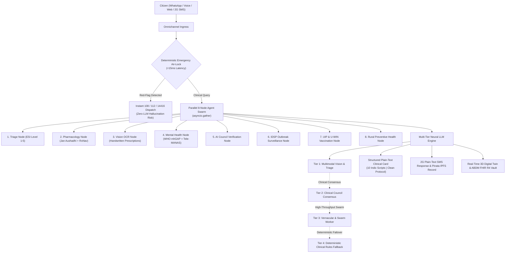
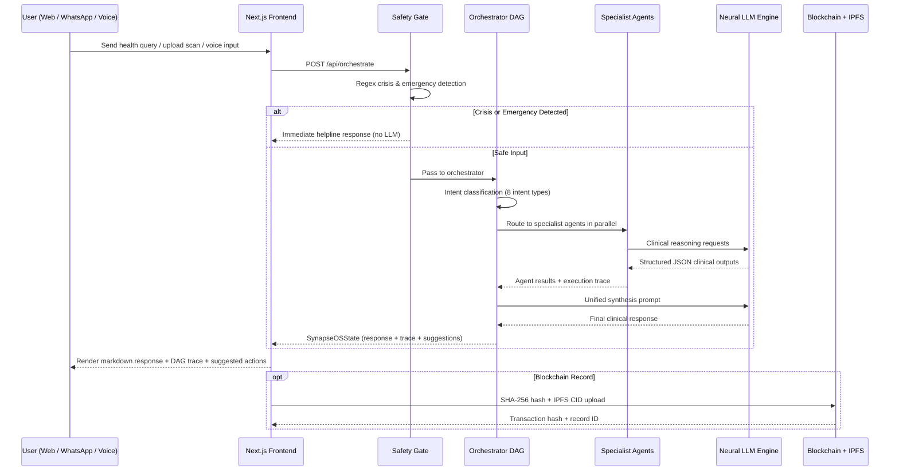

<div align="center">

# Synapse-OS — Autonomous Urban Health Grid
> **Core Architecture:** Multimodal AI Hero Layer + Deterministic Safety Architecture <br/>
> **Vision:** Reimagining Indian municipal healthcare as an ambient, decentralized intelligence grid accessible to 650+ million citizens over WhatsApp without apps, downloads, or clinical friction.
[](https://github.com/Rachit-Tiwari-7/SYNAPSE-OS/actions)
[-success?style=for-the-badge&logo=pytest&logoColor=white)](https://github.com/Rachit-Tiwari-7/SYNAPSE-OS)
[](https://github.com/Rachit-Tiwari-7/SYNAPSE-OS)
[](https://github.com/Rachit-Tiwari-7/SYNAPSE-OS)
[](https://opensource.org/licenses/MIT)
[](https://developers.facebook.com/)
[](https://github.com/Rachit-Tiwari-7/SYNAPSE-OS)
[](https://nextjs.org/)
[](https://fastapi.tiangolo.com/)
[](https://docker.com)
</div>
---
## Executive Summary
**Synapse-OS** is an open-source, production-grade **Autonomous Urban Healthcare Operating Grid**. It turns everyday smartphones, WhatsApp, and 2G SMS into a proactive municipal health system.
### Key Problems Solved
1. **Prescription & Comprehension Gap**: Transcribes blurry Indian handwritten doctor prescriptions via Multimodal Vision AI and maps generic PM-JAY Jan Aushadhi alternatives to cut medicine bills by up to 85%.
2. **Hospital OPD Queue Overload**: Provides instant ESI Level 1–5 triage, pediatric safety air-locks, and 1-click 108/112 SOS dispatch.
3. **Outbreak Blindspots**: Aggregates anonymized symptom signals over WhatsApp to model effective reproduction numbers ($R_0$) and alert health commissioners 48 hours before hospital OPD queues surge.
---
## Table of Contents
- [System Architecture](#system-architecture)
- [Agent Swarm (13 Agents)](#agent-swarm--13-specialized-agents)
- [Two-Factor Authentication (2FA)](#two-factor-authentication-2fa)
- [Blockchain Architecture](#blockchain-architecture)
- [Wearable Telemetry Pipeline](#wearable-telemetry-pipeline)
- [Multilingual Architecture](#multilingual-architecture)
- [Omnichannel 2-Way SMS & IPFS](#omnichannel-2-way-sms-gateway--twilio--pinata-ipfs)
- [Technology Stack](#technology-stack)
- [Application Workflow](#application-workflow)
- [Project Structure](#project-structure)
- [API Reference](#api-reference)
- [Environment Configuration](#environment-configuration)
- [Installation & Local Setup](#installation--local-setup)
- [Docker & Kubernetes Deployment](#docker--kubernetes-deployment)
- [Security Considerations](#security-considerations)
- [Automated Testing & CI/CD](#automated-testing--cicd-pipelines)
- [License](#license)
---
## System Architecture

### Engineering Pillars
| # | Pillar | Implementation |
| :-: | :--- | :--- |
| **1** | **Deterministic Emergency Air-Lock** | Acute emergencies (cardiac, stroke, anaphylaxis, suicide) bypass LLMs via a `<15ms` regex gate in `safety_router.py`. |
| **2** | **Multi-Tier Neural Intelligence** | Sub-second multimodal vision & triage, verified by multidisciplinary council consensus with deterministic rule fallbacks. |
| **3** | **Handwritten OCR & Jan Aushadhi Savings** | Blurry Indian doctor prescriptions transcribed into FHIR dosage structures and matched with PM-JAY generic databases. |
| **4** | **10 Indic Languages over WhatsApp** | Code-mixed understanding across Hindi, Bengali, Tamil, Telugu, Marathi, Gujarati, Kannada, Malayalam, Punjabi, Odia. |
| **5** | **Clean WhatsApp Protocol (`AGENTS.md`)** | Clean plain text badges (`🔴 SYNAPSE EMERGENCY TRIAGE`), council consensus percentages, and 1-click reply shortcuts. |
| **6** | **Interactive 3D Anatomical Twin** | Real-time WebGL/Three.js human anatomical twin visualizing physiological organ vitality scores. |
| **7** | **IDSP Outbreak Surveillance EWS** | District-level surge tracking ($R_t$) with municipal ward heatmaps and automated advisory broadcasts. |
| **8** | **UIP & U-WIN Immunization Engine** | Automated milestone schedule computation (Birth to 16 years) and digital certificate generation. |
| **9** | **2G SMS & Pinata IPFS Gateway** | Standard GSM feature phone support via Twilio SMS with decentralized IPFS record storage. |
| **10** | **Automated Quality Verification** | 197 automated test cases passing 100% green across FastAPI backend and WhatsApp microservice. |
---
## Agent Swarm — 13 Specialized Agents
All 13 agents share a common `SynapseOSState` Pydantic schema and contribute structured outputs to a unified execution trace.
### Interface & Orchestration
|
 Agent 
|
 File 
|
 Responsibility 
|
 Key Triggers 
|
|
:---
|
:---
|
:---
|
:---
|
|
**
Deterministic Safety Gate
**
|
`core/safety_router.py`
|
 Pre-pipeline intercept for crisis & medical emergencies using regex 
|
 "chest pain", "unconscious", "kill myself" 
|
|
**
Orchestrator DAG
**
|
`agents/orchestrator.py`
|
 Intent classification → agent routing → result merge → synthesis 
|
 Every incoming message 
|
### Clinical Intelligence Cluster
|
 Agent 
|
 File 
|
 Responsibility 
|
 Key Technologies 
|
|
:---
|
:---
|
:---
|
:---
|
|
**
Clinical Symptom Triage
**
|
`agents/triage_agent.py`
|
 ESI Level 1-5 severity classification with multilingual output 
|
 Neural LLM Engine 
|
|
**
Drug Safety & RxNav
**
|
`agents/drug_agent.py`
|
 NIH RxNorm drug normalization, 7 high-risk DDI pairs, CYP3A4 logic 
|
 NIH RxNav REST API, Neural LLM Engine 
|
|
**
Medical Scan AI
**
|
`agents/scan_agent.py`
|
 FractureNet YOLOv8 bone fracture detection (
`Final.pt`
), MONAI DenseNet-121 chest PA 
|
 Custom YOLOv8, MONAI, Vision AI 
|
|
**
Hybrid Retrieval Agent
**
|
`agents/retrieval_agent.py`
|
 Wikipedia Medical REST + 23 WHO/ICMR guideline index search 
|
 Wikipedia REST API 
|
|
**
Mental Health Agent
**
|
`agents/mental_health_agent.py`
|
 Tele-MANAS (14416) integration, WHO mhGAP protocol routing 
|
 Neural LLM Engine 
|
### Public Health Cluster
|
 Agent 
|
 File 
|
 Responsibility 
|
 Key Technologies 
|
|
:---
|
:---
|
:---
|
:---
|
|
**
Outbreak Surveillance
**
|
`agents/outbreak_agent.py`
|
 District IDSP/WHO outbreak risk, $R_0$ velocity, WhatsApp/SMS advisory 
|
 OpenWA WhatsApp Gateway 
|
|
**
Universal Immunization
**
|
`agents/vaccination_agent.py`
|
 UIP schedule (Birth → 16 years), U-WIN certificate generation 
|
 Neural LLM Engine 
|
|
**
Preventive Health Hub
**
|
`agents/preventive_health_agent.py`
|
 ORS preparation, POSHAN nutrition, community health quizzes 
|
 Neural LLM Engine 
|
### Records & Digital Twin Cluster
|
 Agent / Service 
|
 File 
|
 Responsibility 
|
|
:---
|
:---
|
:---
|
|
**
3D Digital Health Twin
**
|
`ml/digital_twin.py`
|
 10-year multi-organ trajectory simulation (Cardiovascular, Renal, Hepatic, Pancreatic, Pulmonary). 
|
|
**
Clinical Diagnostics ML
**
|
`ml/diagnostics.py`
|
 Framingham CVD risk, ADA Diabetes 10-year risk, CKD eGFR, FIB-4 calculations. 
|
|
**
ABDM Gateway
**
|
`services/abdm_service.py`
|
 14-digit ABHA ID generation (ABDM Sandbox), PM-JAY coverage verification. 
|
|
**
HL7 FHIR R4 Service
**
|
`services/fhir_service.py`
|
 Compliant FHIR R4 Bundles (Patient, Observation, Condition) with LOINC codes. 
|
|
**
PDF Report Generator
**
|
`services/pdf_service.py`
|
 Clinical PDF summary with verifiable blockchain QR code. 
|
|
**
Verification Agent
**
|
`agents/verification_agent.py`
|
 Cross-validates clinical responses against evidence grounding. 
|
|
**
Appointment Agent
**
|
`agents/appointment_agent.py`
|
 Doctor scheduling, calendar slot management, tele-consultation routing. 
|
---
## Two-Factor Authentication (2FA)
> **Full documentation:** [`docs/2FA.md`](./docs/2FA.md)
Production-grade **multi-factor authentication system** built into Next.js App Router — no third-party auth provider required.
|
 Capability 
|
 Implementation 
|
 File 
|
|
:---
|
:---
|
:---
|
|
**
Registration
**
|
 Email + password, bcrypt 12 rounds 
|
`auth/[action]/route.ts`
|
|
**
Email Verification
**
|
 6-digit OTP via Resend, 10-min TTL 
|
`resend-mailer.ts`
|
|
**
TOTP 2FA Setup
**
|
 QR code + manual key, speakeasy (RFC 6238) 
|
`mfa/[action]/route.ts`
|
|
**
Session Management
**
|
 Multi-session list, revoke by ID, httpOnly cookies 
|
`SecuritySessionsPanel.tsx`
|
|
**
Middleware Guard
**
|
 Cookie-validated session guard on protected routes 
|
`middleware.ts`
|
---
## Blockchain Architecture
### Smart Contract: `MedicalRecords.sol`
Deployed on **Hardhat local node** (development) and **Ethereum Sepolia testnet** (staging). Provides SHA-256 file integrity verification and owner-controlled access management.
```solidity
Contract: MedicalRecords (Solidity 0.8.20)
├── Data Structure: Record { owner, fileHash, cid, timestamp }
├── Mappings: records (bytes32 → Record), access (bytes32 → address → bool)
└── Functions: registerRecord(), grantAccess(), revokeAccess(), hasAccess()
```
---
## Wearable Telemetry Pipeline
Ingests real-world health telemetry from consumer wearables (Apple HealthKit / Google Health Connect) into HL7 FHIR R4 bundles with standard LOINC codes:
|
 Telemetry Signal 
|
 LOINC Code 
|
 Clinical Use 
|
|
:---
|
:---
|
:---
|
|
 Heart Rate (BPM) 
|
 8867-4 
|
 Resting HR, tachycardia detection 
|
|
 SpO₂ (%) 
|
 59408-5 
|
 Hypoxia screening 
|
|
 HRV (ms) 
|
 80404-7 
|
 Autonomic recovery / stress index 
|
|
 Single-Lead ECG 
|
 131344-0 
|
 Atrial fibrillation screening 
|
|
 Steps (daily) 
|
 41950-7 
|
 Physical activity adherence 
|
---
## Multilingual Architecture
Supports **11 Indic languages + English** across frontend UI and backend clinical responses:  
`en` (English), `hi` (Hindi), `bn` (Bengali), `ta` (Tamil), `te` (Telugu), `mr` (Marathi), `gu` (Gujarati), `kn` (Kannada), `ml` (Malayalam), `pa` (Punjabi), and `or` (Odia).
---
## Omnichannel 2-Way SMS Gateway & Twilio / Pinata IPFS
Provides a 2-way conversational SMS engine for **2G feature phones**, integrated with **Twilio** and **Pinata IPFS**.
1. **Zero-Mode Natural Intent Tracking**: Text free-form queries (*"severe headache"*, *"combiflam with dolo"*, *"baby vaccine at 6 weeks"*).
2. **Interactive Menus**: Text `hi` or `menu` for an instant structured key-driven option menu.
3. **Pinata IPFS Records**: Automatically pins diagnostic JSON/PDF reports to IPFS and sends short gateway links via SMS.
---
## Technology Stack
|
 Layer 
|
 Primary Technologies 
|
|
:---
|
:---
|
|
**
Frontend
**
|
 Next.js 16.3, React 19, TypeScript 5, Tailwind CSS 4, Lucide React, Ethers.js v6 
|
|
**
Backend
**
|
 FastAPI, Python 3.11, Pydantic v2, Uvicorn, HTTPX, Pillow, ReportLab 
|
|
**
AI / ML
**
|
 FractureNet YOLOv8 (
`Final.pt`
), MONAI DenseNet-121, Multimodal Vision & Triage Engine 
|
|
**
Blockchain
**
|
 Solidity 0.8.20 (
`MedicalRecords.sol`
), Hardhat, Ethereum Sepolia, Pinata IPFS 
|
|
**
Messaging
**
|
 Meta WhatsApp Cloud API v20.0, Twilio SMS, OpenWA 
|
|
**
Infrastructure
**
|
 Docker Compose, Kubernetes, Redis 7 
|
---
## Application Workflow

---
## Project Structure
```
Synapse-OS/
├── frontend/                         # Next.js 16 App Router Frontend
│   ├── src/app/                      # App Router pages & API routes
│   ├── src/components/               # Copilot, 3D Body Twin, Visual Analytics, Panels
│   ├── src/context/                  # Language & Auth contexts
│   └── Dockerfile
│
├── backend/                          # FastAPI Multi-Agent Core
│   ├── app/agents/                   # 11 specialist agent modules
│   ├── app/api/endpoints.py          # 30+ REST API endpoints
│   ├── app/core/                     # Safety router gate & SynapseOSState
│   ├── app/ml/                       # Digital twin & diagnostics ML
│   ├── app/services/                 # SMS, IPFS, WhatsApp, FHIR R4, PDF generators
│   ├── Final.pt                      # YOLOv8 FractureNet weights
│   ├── requirements.txt
│   └── Dockerfile
│
├── blockchain/contracts/             # MedicalRecords.sol & Hardhat deploy scripts
├── docs/                             # Architecture & feature docs
├── k8s/                              # 8 Kubernetes manifests
└── docker-compose.yml                # Full local stack
```
---
## API Reference
All endpoints served at `http://localhost:8000/api`. Interactive OpenAPI docs available at `http://localhost:8000/docs`.
### Agent Swarm Endpoints
- `POST /api/orchestrate` — Full DAG pipeline (intent → agents → synthesis)
- `POST /api/triage` — ESI Level 1-5 symptom triage
- `POST /api/drugs/check` — NIH RxNorm drug interaction check
- `POST /api/scans/analyze` — YOLOv8 / MONAI medical image analysis
- `POST /api/scans/prescription-ocr` — Multimodal Vision handwritten prescription OCR
- `POST /api/digital-twin/simulate` — 10-year multi-organ trajectory simulation
### Health & Records Endpoints
- `GET /api/abdm/generate-id` — Generates 14-digit ABHA ID + PM-JAY profile
- `POST /api/reports/generate-pdf` — Clinical PDF with blockchain QR code
- `GET /api/fhir/bundle` — HL7 FHIR R4 patient bundle
- `POST /api/sos/dispatch` — 1-click Emergency SOS dispatch
- `POST /api/whatsapp/webhook` — Meta WhatsApp Cloud API webhook
- `POST /api/sms/webhook` — Twilio 2-Way SMS webhook
- `POST /api/ipfs/pin-json` — Pinata IPFS FHIR record pinning
---
## Environment Configuration
Copy `.env.example` to `.env`:
|
 Category 
|
 Variable 
|
 Required 
|
 Purpose 
|
|
:---
|
:---
|
:---
|
:---
|
|
**
Meta WhatsApp
**
|
`WHATSAPP_CLOUD_API_TOKEN`
|
 Optional 
|
 Meta Graph API Bearer Token 
|
|
**
Meta WhatsApp
**
|
`WHATSAPP_PHONE_NUMBER_ID`
|
 Optional 
|
 Meta Phone Number ID 
|
|
**
Twilio SMS
**
|
`TWILIO_ACCOUNT_SID`
|
 Optional 
|
 Twilio Account SID 
|
|
**
Twilio SMS
**
|
`TWILIO_AUTH_TOKEN`
|
 Optional 
|
 Twilio Auth Token 
|
|
**
IPFS / Web3
**
|
`PINATA_JWT`
|
 Optional 
|
 Pinata JWT for IPFS pinning 
|
|
**
LLM Engine
**
|
`GEMINI_API_KEY`
|
 Optional 
|
 Neural LLM API key for live reasoning 
|
|
**
LLM Engine
**
|
`GEMINI_MODEL`
|
 Optional 
|
 Default model configuration 
|
|
**
Blockchain
**
|
`BLOCKCHAIN_RPC_URL`
|
 Optional 
|
 EVM RPC URL (
`http://127.0.0.1:8545`
) 
|
---
## Installation & Local Setup
### Quick Start
```bash
# 1. Clone repository
git clone https://github.com/Rachit-Tiwari-7/SYNAPSE-NEURAL.git
cd Synapse-OS
# 2. Configure environment
cp .env.example .env
# 3. Start Backend
cd backend
pip install -r requirements.txt
python -m uvicorn app.main:app --host 127.0.0.1 --port 8000 --reload
# 4. Start Frontend (New terminal)
cd frontend
npm install
npm run dev
```
---
## Docker & Kubernetes Deployment
### Docker Compose
```bash
docker compose up --build                       # Development
docker compose -f docker-compose.prod.yml up -d # Production
```
### Kubernetes Deployment
```bash
kubectl apply -f k8s/namespace.yaml
kubectl apply -f k8s/
```
---
## Security Considerations
- **Deterministic Safety Gate**: Acute medical emergencies bypass LLMs via a `<15ms` regex gate in `safety_router.py`.
- **Non-Root Containers**: Frontend and backend Docker images run under non-root security contexts (`appuser` UID 1000).
- **Session & Auth Security**: httpOnly cookies, TOTP MFA (speakeasy), bcrypt 12-round password hashing, Resend email OTP.
- **Blockchain & IPFS Integrity**: SHA-256 client-side hashing before contract deployment; owner access controls on `MedicalRecords.sol`.
---
## Automated Testing & CI/CD Pipelines
Synapse-OS maintains a **190+ automated Pytest test suite** with 100% pass rates across 14 test modules:
```bash
# Run full backend test suite
make test
# Run life-safety regression tests only
make test-safety
```
---
## License
- Smart contract component (`blockchain/contracts/`): **ISC**
- Core platform & documentation: **MIT License**
<div align="center">
---
### Synapse-OS — Autonomous Urban Health Grid
*13 Agents · Multimodal AI · 11 Languages · Blockchain-Verified · ABDM-Compliant*
</div>
